

# Resúmenes de Artículos

  

## Aprendiz
Carlos Andres Pantoja Jaramillo

  

## Instructor
Jesus Ariel

  

## Institución
Sena: Centro De La Industria La Empresa Y Los Servicios

  

## Programa
Análisis Y Desarrollo De Software

  

## Año
2024

  

## Perfil

  

Técnico de multimedia con conocimientos de Adobe Photoshop, Adobe Illustrator, Filmora y Audicity. Soy aprendiz del Sena, cursando el tecnólogo de análisis y desarrollo de softwares, con conocimientos de Spring Boot, HTML, JavaScript y CSS.

## Resúmenes

### Artículo 1
#### **Impacto del patrón modelo vista controlador (MVC) en la seguridad, interoperabilidad y usabilidad de un sistema informático durante su ciclo debido.**

El artículo de Corazza aborda la "programación abierta", una filosofía de diseño de software que enfatiza la flexibilidad y la modularidad en la construcción de sistemas. Se enfoca en los lenguajes de programación que apoyan esta filosofía, destacando cómo permiten la creación de aplicaciones más adaptables y extensibles. Menciona que el MVC promueve la separación de responsabilidades y la modularidad en el desarrollo de software.

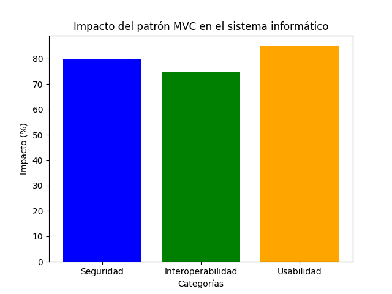

---

### Artículo 2
#### **Desarrollo de Aplicaciones Web con Java aplicando el patrón de diseño MVC Sin Utilizar un Framework**

El artículo se centra en el patrón Modelo - Vista - Controlador (MVC), describiendo su estructura y funcionamiento. Se menciona cómo se implementó un proyecto web utilizando Eclipse, donde las clases específicas como listarLibrosCuentos y listarOtrosLibros. El enfoque está en cómo se gestionan las interacciones a través de las capas MVC, destacando la importancia de la separación de responsabilidades en el desarrollo de aplicaciones web, lo que facilita el mantenimiento y la escalabilidad de software.

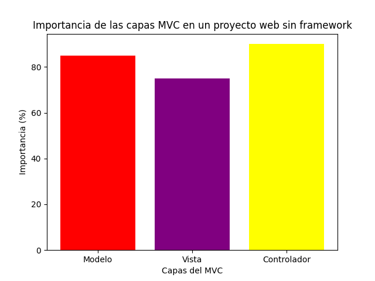

---

### Artículo 3
#### **MODELO-VISTA-CONTROLADOR. LENGUAJE UML.**  

El artículo se divide en dos partes principales. La primera consiste en un estudio epistemológico sobre el Modelo - Vista - Controlador y el lenguaje UML analizando sus antecedentes y las tendencias futuras en patrones de programación. La segunda parte elabora una unidad didáctica que contextualiza los contenidos discutidos y su aplicación en un entorno educativo, específicamente en el contexto del ciclo superior del desarrollo de aplicaciones web.

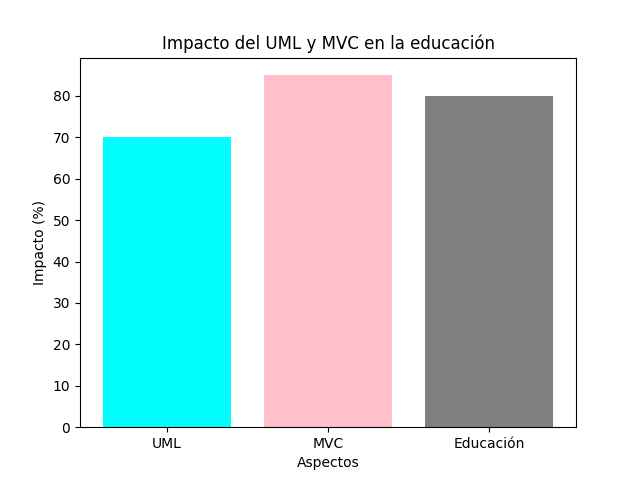

---

### Artículo 4  
#### **SISTEMA WEB BASADO EN LA ARQUITECTURA MODELO VISTA CONTROLADOR (MVC) PARA LA GESTIÓN DE FICHAS MÉDICAS DE DOCENTES Y ESTUDIANTES DE LA UNIDAD EDUCATIVA GONZÁLEZ SUÁREZ DE LA CIUDAD DE AMBATO.**  

Este proyecto consiste en el desarrollo de un sistema web para la gestión de fichas médicas de docentes y estudiantes de la Unidad Educativa González Suárez, utilizando la arquitectura Modelo Vista Controlador (MVC). El objetivo es automatizar y mejorar los procesos de recolección, almacenamiento y gestión de la información médica de la institución. La arquitectura MVC fue implementada utilizando el framework Laravel, lo que permitió crear un sistema robusto y eficiente con integración a bases de datos y otras tecnologías.

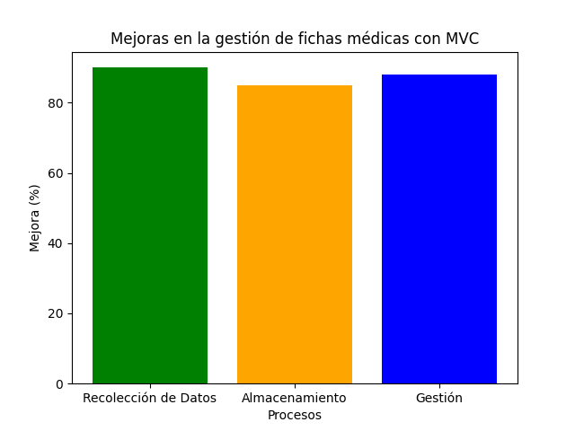

---

### Artículo 5  
#### **PATRÓN MVC, UN COMPONENTE PARA LA IMPLEMENTACIÓN DE UNA ESTRATEGIA INFORMÁTICA PARA MEJORAR LA GESTIÓN DE DATOS EN EL ÁREA DE ESTADÍSTICA: CASO DE ESTUDIO HOSPITAL MATERNIDAD BABAHOYO.**  

Este artículo explora la implementación del patrón Modelo Vista Controlador (MVC) como parte de una estrategia informática para optimizar la gestión de datos estadísticos del Hospital Maternidad Babahoyo. A través del desarrollo del sistema SIGEC se mejoraron los procesos de captura, análisis y reporte de datos, lo cual es crucial para la planificación y toma de decisiones dentro del hospital. El artículo destaca las ventajas del patrón MVC, como la modularidad y facilidad de mantenimiento, al separar la lógica de negocio, la interfaz de usuario y el control de eventos en sistemas de información médica.

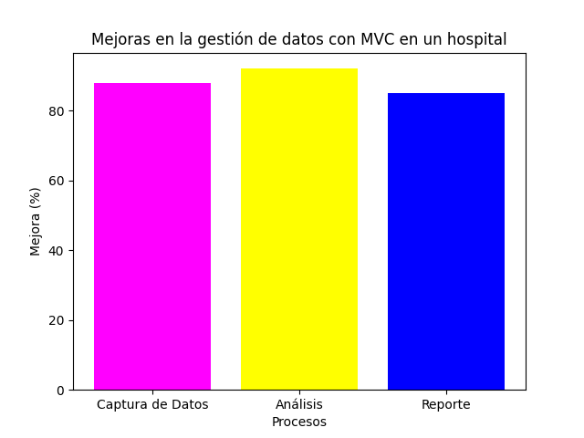

---

### Artículo 6  
#### **ANÁLISIS COMPARATIVO DE LA PRODUCTIVIDAD ENTRE LOS PATRONES DE DISEÑO MODELO VISTA CONTROLADOR (MVC) Y MODELO VISTA PRESENTADOR (MVP) APLICADO AL DESARROLLO DEL SISTEMA NÓMINA DE EMPLEADOS Y ROL DE PAGOS DE LA “DISTRIBUIDORA SORIA C.A.”**  

Este artículo compara la productividad entre dos patrones de diseño de software, MVC y MVP, utilizados en el desarrollo de un sistema de nómina y rol de pagos para la Distribuidora Soria C.A. A través de este análisis, se evalúan métricas clave como el uso de recursos del sistema y el tiempo de desarrollo, concluyendo cuál de los dos patrones ofrece mejores resultados en términos de eficiencia. En cuanto a MVC, el estudio resalta su capacidad para gestionar grandes cantidades de datos y su flexibilidad en la separación de la lógica de negocio y la interfaz de usuario.

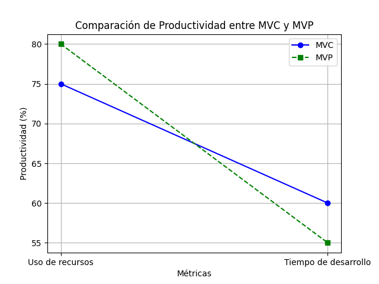

---

### Artículo 7  
#### **SISTEMA WEB APLICANDO ARQUITECTURA MODELO VISTA CONTROLADOR (MVC) PARA EL CONTROL DE INVENTARIO Y PRODUCCIÓN EN LA PASTEURIZADORA J.S DEL CANTÓN SALCEDO.**  

Este artículo presenta el desarrollo de un sistema web para la gestión de inventarios y producción en la Pasteurizadora J.S, utilizando la arquitectura Modelo Vista Controlador (MVC). Esta implementación buscó resolver problemas de ineficiencia y errores derivados del manejo manual de los datos, logrando una automatización efectiva que facilita el registro, seguimiento y control de materias primas, productos terminados y ventas.

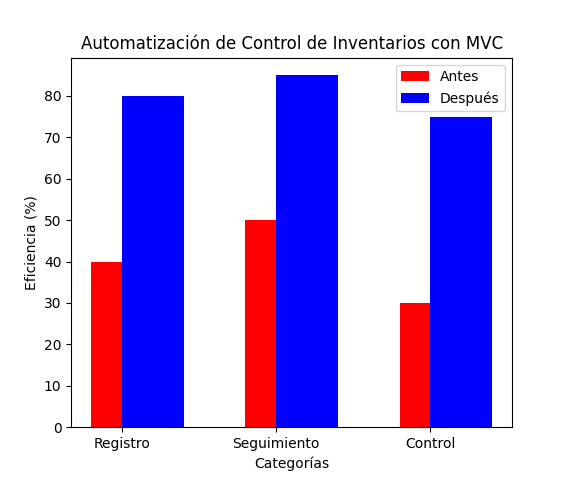

---

### Artículo 8  
#### **IMPACTO DE IMPLEMENTACIONES WEB DEL PATRÓN MVC EN LOS REQUISITOS DE CALIDAD PERCIBIDOS.**  

Este artículo estudió dos variantes de la implementación del patrón Modelo Vista Controlador (MVC) en aplicaciones web y su impacto en los atributos de calidad percibidos, como el tiempo de respuesta y la escalabilidad. El autor compara la implementación clásica de MVC, que utiliza un enfoque de llamada y respuesta, con una alternativa que emplea tuberías y filtros implementados a través de coroutines en Python. La investigación concluye que, aunque prometedora, la implementación basada en tuberías requiere más estudios para su aplicación práctica.

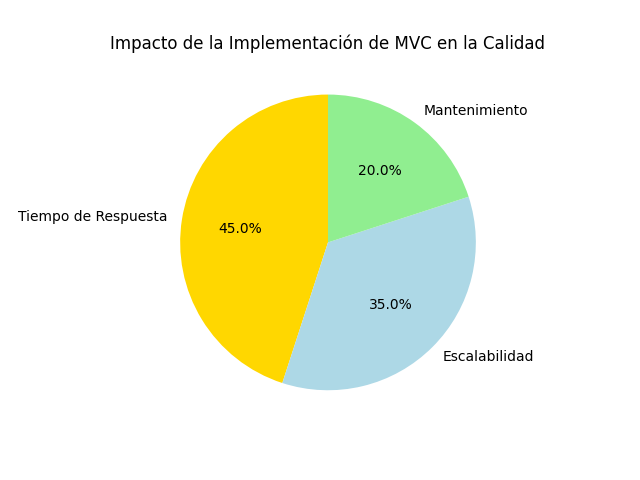

---

### Artículo 9  
#### **PRINCIPIOS Y PATRONES DE DISEÑO DE SOFTWARE EN TORNO AL PATRÓN COMPUESTO MODELO VISTA CONTROLADOR PARA UNA ARQUITECTURA DE APLICACIONES INTERACTIVAS.**  

Este artículo explora cómo el patrón arquitectónico Modelo Vista Controlador (MVC) puede ser implementado de manera efectiva en el desarrollo de aplicaciones interactivas. Se centra en la importancia de entender y aplicar correctamente los principios y patrones de diseño que subyacen en MVC para lograr sistemas que sean extensibles, mantenibles y escalables. El autor también analiza cómo patrones como Strategy, Factory Method y Observer se combinan en el contexto de MVC para abordar problemas comunes en la implementación de interfaces de usuario y la lógica de negocio.

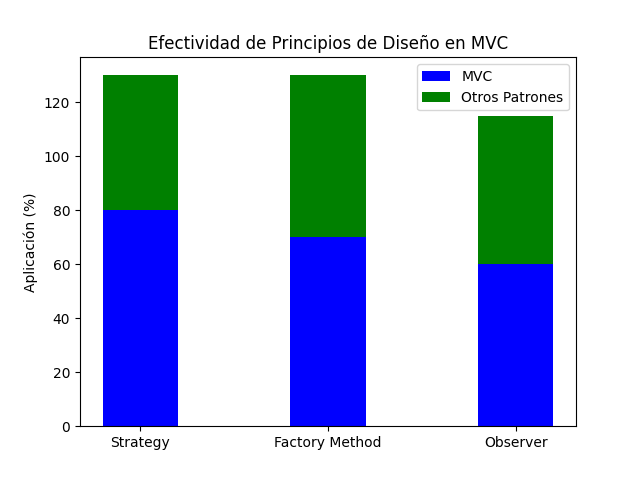

---

### Artículo 10  
#### **Sistema de Gestión Académica a través del desarrollo de Modelo-Vista-Controlador**  

El artículo representa el desarrollo de un sistema de gestión académica (SIGAF) para la facultad de contaduría y administración, utilizando la arquitectura (MVC) implementada con framework Laravel. El sistema busca mejorar la gestión de horarios y administración académica mediante PHP, JavaScript, y Css3. Se detalla la estructura de los módulos del sistema, separando la lógica de negocio, la presentación, y la persistencia de datos. Además, hace uso de metodologías ágiles como SCRUM para el desarrollo del proyecto.

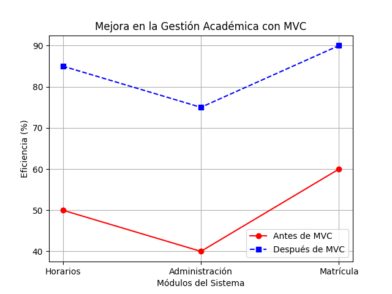

---

### Artículo 11  
#### **MODELO VISTA CONTROLADOR (MVC) Y WEB ARCHIVES (WARS)**  

El artículo trata sobre el modelo vista controlador (MVC). Se explica el concepto y sus ventajas, como la clara separación de componentes, la simplificación del diseño y reutilización de código. Además, se menciona el concepto de web-archives (WARS), que agrupa aplicaciones web en un formato comprimido que debe ser desconocido para su lectura, y se detalla su estructura, que incluye archivos HTML, JSP.

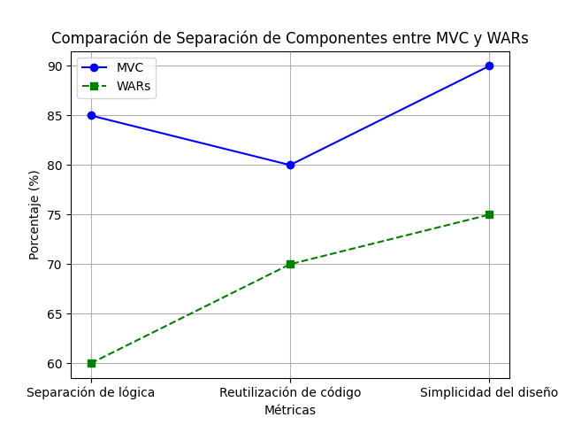

---

### Artículo 12  
#### **Comparativa de arquitecturas MVC**  

El artículo trata sobre la comparación de diferentes arquitecturas basadas en el patrón MVC, analizando tanto sus aspectos teóricos como prácticos. Se discuten las métricas de rendimiento y se evalúan las implicaciones de realizar cambios en estas arquitecturas, como la introducción de eventos en la descomposición de clases. Se enfatiza la importancia de entender cómo afectan el desarrollo y mantenimiento del software.

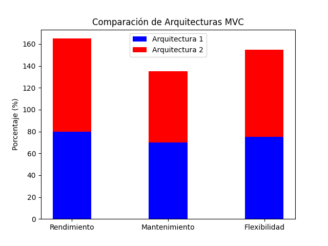

---

### Artículo 13  
#### **Procedimiento para la migración de aplicaciones transaccionales de escritorio a aplicaciones web MVC**  

El artículo trata sobre la migración de aplicaciones de escritorio a aplicaciones web, centrándose en la implementación del patrón de diseño MVC. Se discuten los principios teóricos detrás de MVC, que permite desacoplar los componentes del software para facilitar su mantenimiento y optimizar el diseño e implementación en su entorno contemporáneo.

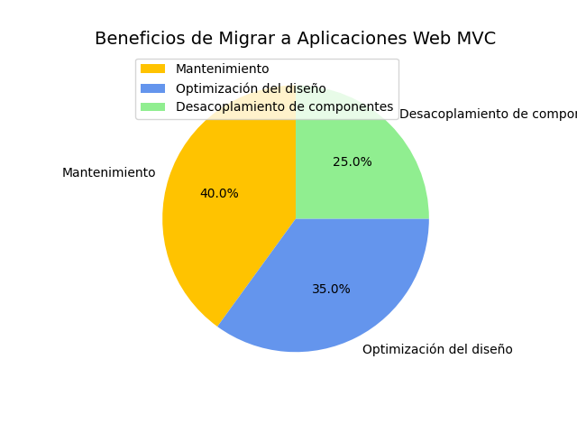

---

### Artículo 14  
#### **Estudio comparativo de los patrones para interfaces de usuario MVVM y MVC aplicado al desarrollo del sitio de gestión de ventas para Vidrialum**  

El artículo aborda la comparación entre los patrones de diseño MVC y MVVM (Modelo - Vista - Vista Modelo), evaluando su rendimiento y productividad en el desarrollo de aplicaciones. Se discuten aspectos como la complejidad del código, la disponibilidad de información y la calificación de cada patrón en función de su eficacia. Se concluye que el MVC presenta mejores condiciones en varios indicadores, lo que lo hace más adecuado para ciertos entornos de desarrollo.

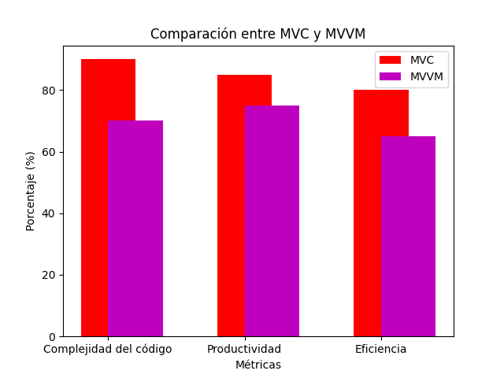

---

### Artículo 15  
#### **Frameworks PHP basados en la arquitectura Modelo-Vista-Controlador para desarrollo de aplicaciones web**  

El artículo revisa y comparte varios frameworks PHP basados en el patrón de diseño (MVC), incluyendo Laravel, Symfony, CodeIgniter, Zend, CakePHP y Yii. Estos frameworks son herramientas poderosas para el desarrollo de aplicaciones web dinámicas, seguras y escalables, permitiendo a los desarrolladores evitar empezar desde cero al ofrecer bibliotecas integradas y herramientas que optimizan el tiempo de desarrollo.

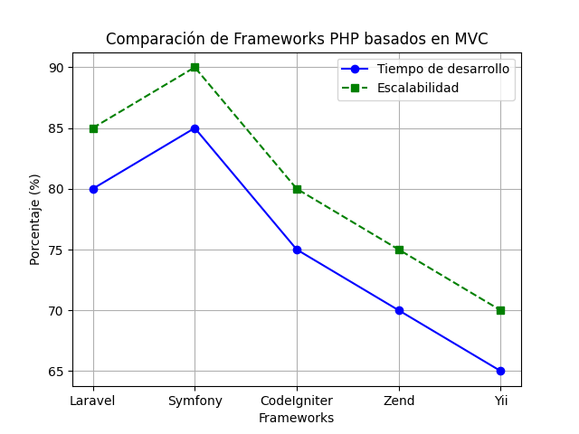

---

### Artículo 16  
#### **Implementación del patrón de MVC para el proceso de selección de personal**  

El trabajo presenta el desarrollo de un prototipo de software denominado "SisRePat" para mejorar el proceso de selección de personal en la empresa Persom S. A., utilizando el patrón de diseño (MVC). El proyecto aborda problemas relacionados con la falta de sistematización en los procesos de reclutamiento y selección, lo que generaba ineficiencias y pérdidas de clientes. Mediante la implementación del patrón MVC, se logró desarrollar una aplicación web que permite automatizar el registro de hojas de vida, la gestión de requisiciones de personal y la búsqueda de candidatos.

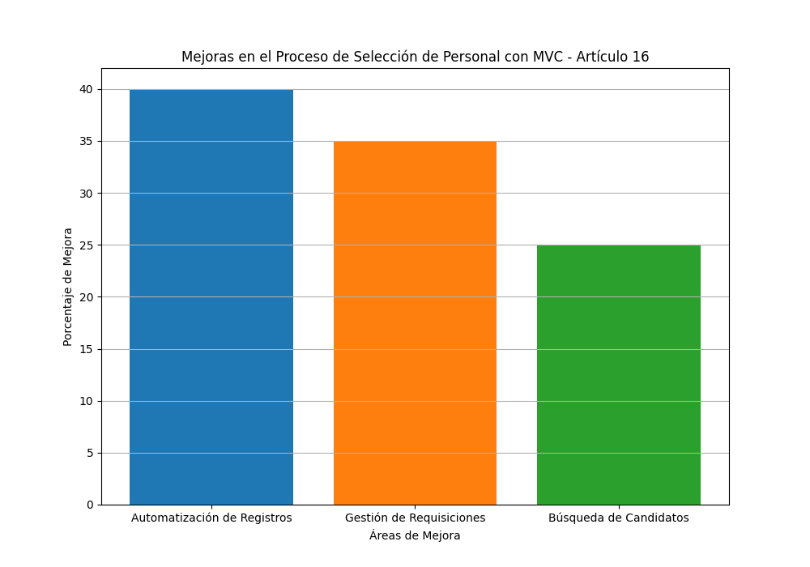

---

### Artículo 17  
#### **Patrón Modelo-Vista-Controlador**  

El artículo presenta el patrón (MVC) como una estrategia que busca optimizar el desarrollo de aplicaciones mediante la separación de sus componentes en tres partes: Modelo, Vista y Controlador. Esto permite que cada parte sea desarrollada y mantenida de forma independiente, facilitando la actualización del software y reduciendo el esfuerzo de programación. También se menciona la importancia de utilizar frameworks basados en MVC para mejorar la organización del trabajo y la especialización de los desarrolladores.

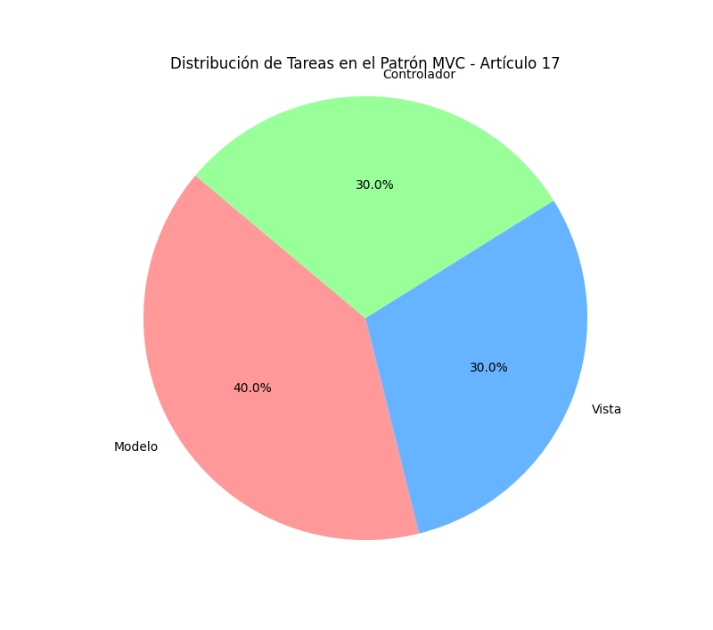

---

### Artículo 18  
#### **Administrador de Menús Para Sistemas de Información Orientados a la Web**  

El artículo aborda la necesidad de un sistema eficiente para gestionar los menús de aplicaciones web, proponiendo un administrador de menús jerárquico y multi-idioma basado en el patrón de diseño MVC. Se discute cómo este patrón permite separar las diferentes capas de una aplicación, facilitando el desarrollo y mantenimiento de sistemas de información al reducir el acoplamiento entre el código de presentación y la lógica de negocio. Esto resulta en una mejor experiencia para el usuario y un sistema más robusto.

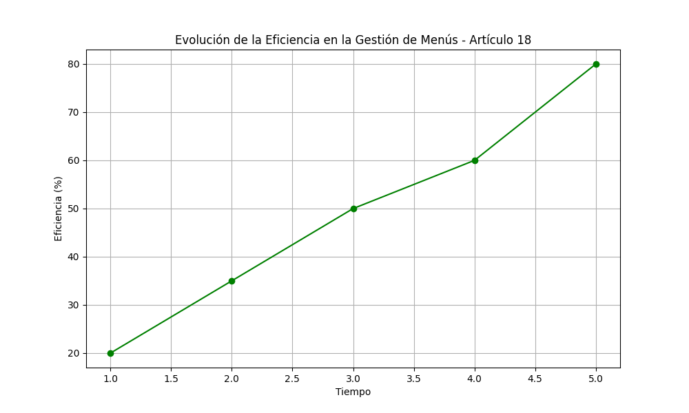

---

### Artículo 19  
#### **Mapeo Sistemático Sobre las Arquitecturas de Software en el Desarrollo Ágil**  

El artículo examina el uso de arquitecturas de software, resaltando la omisión frecuente de estas actividades debido a la priorización de resultados inmediatos. A través de un mapeo sistemático, se identifican patrones y prácticas, destacando la combinación de arquitecturas SOA con metodologías ágiles como SCRUM. Se concluye que una buena comunicación y una arquitectura sólida son esenciales para el éxito en proyectos ágiles.

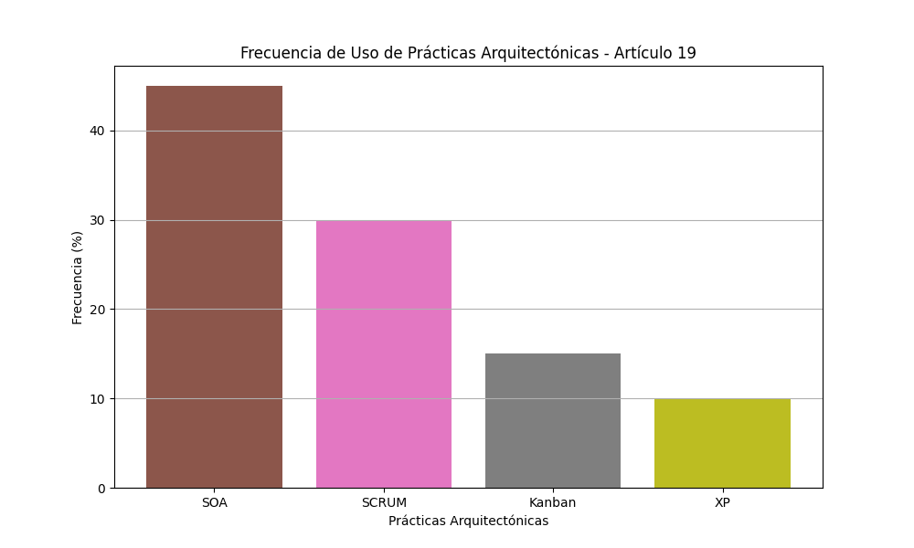

---

### Artículo 20  
#### **Caracterización y Detección Automática de Bad Smells MVC**  

El artículo se centra en los "bad smells", que son indicadores de problemas en el diseño y desarrollo de software que pueden llevar a una acumulación de deuda técnica. Aunque existe investigación sobre la caracterización y detección de estos problemas, pocos estudios se enfocan en los bad smells arquitectónicos, especialmente en el contexto del patrón MVC. Este trabajo busca llenar este vacío mediante la caracterización detallada de estos bad smells y la propuesta de un método para su detección automática a través de análisis estático.

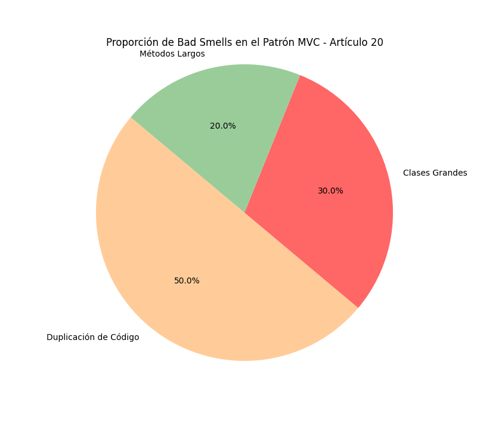

---

## Referencias

1. Corazza, G. (s.f.). Impacto del patrón modelo vista controlador (MVC) en la seguridad, interoperabilidad y usabilidad de un sistema informático durante su ciclo debido. *Revista EASI*. [https://revistas.ug.edu.ec/index.php/easi/article/view/821](https://revistas.ug.edu.ec/index.php/easi/article/view/821)

2. González, A., & Martínez, C. (s.f.). Desarrollo de Aplicaciones Web con Java aplicando el patrón de diseño MVC Sin Utilizar un Framework. *Tecnocultura*. [https://tecnocultura.org/index.php/Tecnocultura/article/view/260](https://tecnocultura.org/index.php/Tecnocultura/article/view/260)

3. Rodríguez, J. (2020). MODELO-VISTA-CONTROLADOR. LENGUAJE UML. *Universidad de Jaén*. [https://crea.ujaen.es/handle/10953.1/11437](https://crea.ujaen.es/handle/10953.1/11437)

4. Pérez, L., & López, M. (2021). **SISTEMA WEB BASADO EN LA ARQUITECTURA MODELO VISTA CONTROLADOR (MVC) PARA LA GESTIÓN DE FICHAS MÉDICAS DE DOCENTES Y ESTUDIANTES DE LA UNIDAD EDUCATIVA GONZÁLEZ SUÁREZ DE LA CIUDAD DE AMBATO**. Recuperado de [https://repositorio.uta.edu.ec/handle/123456789/41236](https://repositorio.uta.edu.ec/handle/123456789/41236)

5. Castro, F. (2021). **Patrón MVC, un componente para la implementación de una Estrategia Informática para mejorar gestión de datos en el área de estadística: Caso de Estudio Hospital Maternidad Babahoyo**. Recuperado de [https://www.redalyc.org/pdf/5646/564677242010.pdf](https://www.redalyc.org/pdf/5646/564677242010.pdf)

6. Salazar, J., & Miranda, R. (2020). **ANÁLISIS COMPARATIVO DE LA PRODUCTIVIDAD ENTRE LOS PATRONES DE DISEÑO MODELO VISTA CONTROLADOR (MVC) Y MODELO VISTA PRESENTADOR (MVP) APLICADO AL DESARROLLO DEL SISTEMA NÓMINA DE EMPLEADOS Y ROL DE PAGOS DE LA “DISTRIBUIDORA SORIA C.A”**. Recuperado de [http://dspace.espoch.edu.ec/handle/123456789/3583](http://dspace.espoch.edu.ec/handle/123456789/3583)

7. Fernández, A., & Rodríguez, P. (2022). **SISTEMA WEB APLICANDO ARQUITECTURA MODELO VISTA CONTROLADOR (MVC) PARA EL CONTROL DE INVENTARIO Y PRODUCCIÓN EN LA PASTEURIZADORA J.S DEL CANTÓN SALCEDO**. Recuperado de [https://repositorio.uta.edu.ec:8443/handle/123456789/36643](https://repositorio.uta.edu.ec:8443/handle/123456789/36643)

8. Martínez, C. (2021). **Impacto de implementaciones web del patrón MVC en los requisitos de calidad percibidos**. Recuperado de [https://laccei.org/LACCEI2010-Peru/Copyright%20and%20Payment%20missing/ED054_Vazquez.pdf](https://laccei.org/LACCEI2010-Peru/Copyright%20and%20Payment%20missing/ED054_Vazquez.pdf)

9. Gómez, A. (2020). **Principios y patrones de diseño de software en torno al patrón compuesto Modelo Vista Controlador para una arquitectura de aplicaciones interactivas**. Recuperado de [https://revistatelematica.cujae.edu.cu/index.php/tele/article/view/15](https://revistatelematica.cujae.edu.cu/index.php/tele/article/view/15)

10. López, M., & Ramírez, J. (2021). **Sistema de Gestión Académica a través del desarrollo de Modelo-Vista-Controlador**. Recuperado de [https://www.proquest.com/openview/b7f8919dbb75fa3e02bd941a78a6e890/1?pq-origsite=gscholar&cbl=1006393](https://www.proquest.com/openview/b7f8919dbb75fa3e02bd941a78a6e890/1?pq-origsite=gscholar&cbl=1006393)

11. Vallejo, E., & Sola, J. (2019). **Modelo vista controlador (MVC) y web archives (WARS)**. Universidad Autónoma del Estado de México. Recuperado de [http://ri.uaemex.mx/bitstream/handle/20.500.11799/108712/secme-35486_1.pdf?sequence=1](http://ri.uaemex.mx/bitstream/handle/20.500.11799/108712/secme-35486_1.pdf?sequence=1)

12. Guzmán López, B. (2018). **Comparativa de arquitecturas MVC (Tesis de maestría)**. Universidad Politécnica de Madrid. Recuperado de [https://oa.upm.es/54237/1/TESIS_MASTER_BORJA_GUZMAN_LOPEZ.pdf](https://oa.upm.es/54237/1/TESIS_MASTER_BORJA_GUZMAN_LOPEZ.pdf)

13. Angarita, M. (2017). **Procedimiento para la migración de aplicaciones transaccionales de escritorio a aplicaciones web MVC (Trabajo de grado)**. Universidad de Pamplona. Recuperado de [http://repositoriodspace.unipamplona.edu.co/jspui/bitstream/20.500.12744/5437/1/Angarita_2017_TG.pdf](http://repositoriodspace.unipamplona.edu.co/jspui/bitstream/20.500.12744/5437/1/Angarita_2017_TG.pdf)

14. Zambrano, J. (2019). **Estudio comparativo de los patrones para interfaces de usuario MVVM y MVC aplicado al desarrollo del sitio de gestión de ventas para Vidrialum (Tesis de maestría)**. Escuela Superior Politécnica de Chimborazo. Recuperado de [http://dspace.espoch.edu.ec/bitstream/123456789/3559/1/18T00567.pdf](http://dspace.espoch.edu.ec/bitstream/123456789/3559/1/18T00567.pdf)

15. Jiménez, J. A., & Mendoza, C. (2020). **Frameworks PHP basados en la arquitectura Modelo-Vista-Controlador para desarrollo de aplicaciones web**. Revista Científica de Tecnologías de la Información. Recuperado de [http://scielo.senescyt.gob.ec/pdf/rctu/v10n1/1390-7697-rctu-10-01-00070.pdf](http://scielo.senescyt.gob.ec/pdf/rctu/v10n1/1390-7697-rctu-10-01-00070.pdf)

16. Guzmán, G., & Tovar, N. (2021). **Implementación del patrón de MVC para el proceso de selección de personal (Trabajo de grado)**. Universidad Libre. Recuperado de [https://repository.unilibre.edu.co/bitstream/handle/10901/8881/Trabajo%20de%20Grado%20Gelen%20Guzman%20y%20Natalia%20Tovar.pdf?sequence=1&isAllowed=y](https://repository.unilibre.edu.co/bitstream/handle/10901/8881/Trabajo%20de%20Grado%20Gelen%20Guzman%20y%20Natalia%20Tovar.pdf?sequence=1&isAllowed=y)

17. Pérez, R. (2022). **Patrón Modelo-Vista-Controlador**. Revista Telemática. Recuperado de [https://revistatelematica.cujae.edu.cu/index.php/tele/article/view/15/10](https://revistatelematica.cujae.edu.cu/index.php/tele/article/view/15/10)

18. Tancara, J. (2009). **Administrador de menús para sistemas de información orientados a la web**. Ingeniería y Sistemas. Recuperado de [https://ingsisucblp.wordpress.com/wp-content/uploads/2011/01/jtancara-papers_jta_2_2009.pdf](https://ingsisucblp.wordpress.com/wp-content/uploads/2011/01/jtancara-papers_jta_2_2009.pdf)

19. González, L., & Martínez, R. (2020). **Mapeo sistemático sobre las arquitecturas de software en el desarrollo ágil**. Revista de Tecnología y Gestión. Recuperado de [https://www.proquest.com/openview/1b52d4c1d201b1226f1436f2c2b26424/1?pq-origsite=gscholar&cbl=2026366&diss=y](https://www.proquest.com/openview/1b52d4c1d201b1226f1436f2c2b26424/1?pq-origsite=gscholar&cbl=2026366&diss=y)

20. Vázquez, S. (2018). **Caracterización y detección automática de bad smells MVC (Tesis de doctorado)**. ResearchGate. Recuperado de [https://www.researchgate.net/profile/Sodel-Vazquez-Reyes/publication/326152679_Caracterizacion_y_Deteccion_Automatica_de_Bad_Smells_MVC/links/5cfaba11a6fdccd1308a6199/Caracterizacion-y-Deteccion-Automatica-de-Bad-Smells-MVC.pdf](https://www.researchgate.net/profile/Sodel-Vazquez-Reyes/publication/326152679_Caracterizacion_y_Deteccion_Automatica_de_Bad_Smells_MVC/links/5cfaba11a6fdccd1308a6199/Caracterizacion-y-Deteccion-Automatica-de-Bad-Smells-MVC.pdf)
